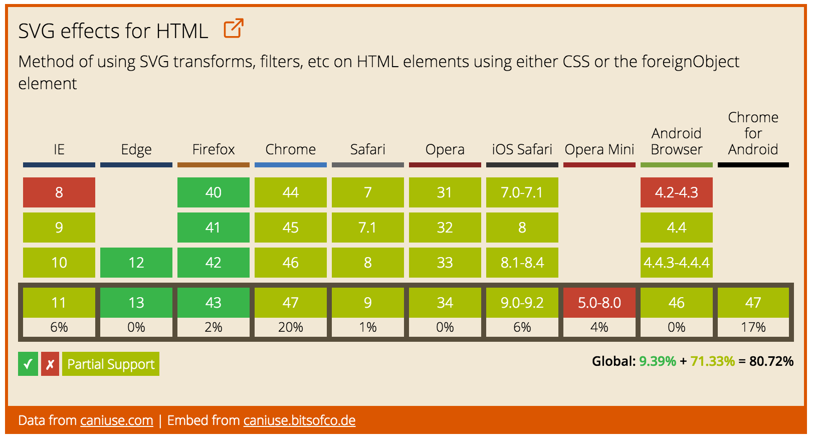

# The (Unofficial) CanIUse Embed

**Embed up-to-date data from caniuse.com**. Displays feature support data for various versions of the 10 major browsers. Configurable, reliable, and fully responsive.

## How to Use

Follow instructions [here](http://caniuse.bitsofco.de/#how-to-use) to generate an embed code.

## Copyright and Licence

- All data is from [caniuse](https://github.com/fyrd/caniuse), which is licenced under the [CC BY 4.0](http://creativecommons.org/licenses/by/4.0/) license.

- This embed is created by [Ire Aderinokun](https://twitter.com/ireaderinokun), and is licenced under the [Apache 2](http://www.apache.org/licenses/LICENSE-2.0) license.
